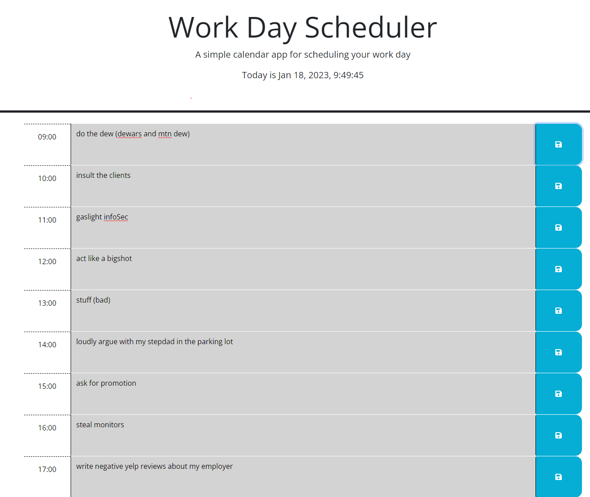

# <Work Day Scheduler>

## Description

This scheduler allows you to plan your work day. I built it from starter code containing the html and css and just wrote the js file. I learned how to use the day.js API and about working with jQuery.

## Usage

Enter your tasks for each hour and then click save. Your saved items will stay on the page and be stored in localStorage

## Credits

Taran Leu

## License

MIT
